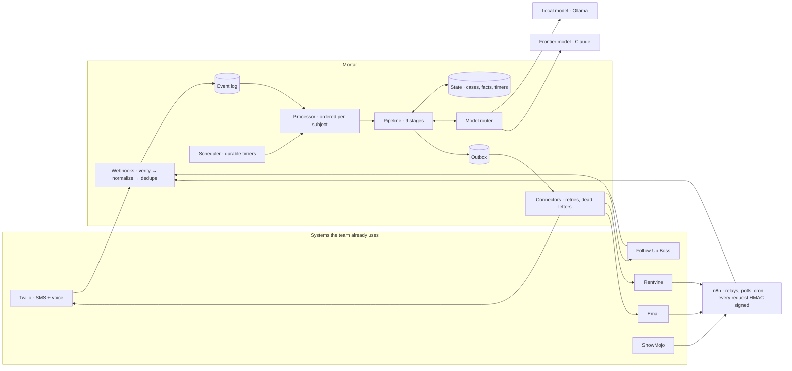
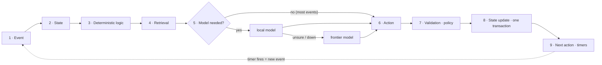

# Mortar

**A 24/7 agentic operating layer for residential property management.**

Mortar sits across Follow Up Boss, ShowMojo, Rentvine, Twilio, email and n8n. It turns every signal into an event, keeps structured state for every case, and decides what should happen next. Ordinary code decides whatever can be decided. A small local model reads what the rules can't. A frontier model is used only where judgment is worth paying for. People keep risk, money and relationships.

> Built as a reference implementation for the BricksFolios *AI automation / agentic systems engineer* role. Northwind Residential (Austin, TX) is a fictional operator. Everything runs offline with simulated systems and models; each connector goes live by configuration, not code changes.

```
Event → State → Deterministic logic → Retrieval → Model (only if needed) → Action → Validation → State update → Next action
```

---

## Quickstart

Requires Node.js 22.13+ (built-in SQLite). No API keys, no Docker, no GPU.

```bash
npm install
npm run demo        # ops console → http://localhost:4000 — pick a story, press "Next step"
npm run demo:cli    # the same stories, printed in the terminal
npm test            # 73 tests
npm run eval        # triage + reply evals with CI gates
```

With real models:

```bash
ollama pull qwen3:4b                      # any small instruct model with reliable JSON output
LOCAL_MODEL_PROVIDER=ollama ANTHROPIC_API_KEY=… npm run demo
```

Production-style: `cp .env.example .env`, then `docker compose up`. Add `--profile n8n` to include n8n, with the workflows from `n8n/` mounted for import.

---

## What it does, measured

Four demo stories, each played through the real pipeline (`npm run demo:cli -- <story>`). "Naive" is the design the JD warns against: every event plus the full customer history goes to a frontier model.

| Story | Decision points | Decided by rules alone | Model calls (local · frontier) | Model tokens vs naive |
|---|---|---|---|---|
| **11:30 PM leak** — water through the ceiling, nobody watching the inbox | 13 | 85% | 2 · 0 | 428 vs 49,143 (−99.1%) |
| **Sensitive tenant** — mold, asthma, rent withholding, a lawyer | 2 | 50% | 1 · 1 | 1,021 vs 3,504 (−70.9%) |
| **Leasing** — inquiry → self-tour → objection → people win | 5 | 60% | 3 · 0 | 555 vs 11,318 (−95.1%) |
| **Owner lead gen** — discover → enrich → score → outreach → meeting → learning | 38 | 76% | 7 · 3 | 2,269 vs 64,534 (−96.5%) |

The leak, end to end, with nobody watching:
- P1 is decided by rules in milliseconds.
- Vetted safety steps go out with the shutoff location retrieved from the building guide.
- A work order is created in Rentvine.
- The plumber ladder runs (#1 declines by keypad, #2 accepts).
- The on-call ladder escalates when nobody acknowledges.
- The unit above is asked to check, and its hedged reply is read by the local model.
- The plumber's free-text findings become a structured follow-up repair.
- That repair exceeds the owner's limit, so it waits for approval. The approval request itself is deferred to 8 AM by quiet hours, and the owner approves by SMS.
- Rentvine marks the repair done, the case resolves, and it closes 72 hours later.

**Evals** (`npm run eval`): 81 labeled maintenance messages and 30 in-case replies.

| Result | Value |
|---|---|
| Emergency recall | 100% (36/36) |
| Emergency precision | 100% |
| Unsafe reply misses | 0 |

Emergency recall and unsafe misses are CI gates. A 20-message **holdout** that was never used for tuning is reported honestly: 62.5% of emergencies are caught *by rules alone*, and the model tier is the backstop for the rest. See [docs/evals.md](docs/evals.md).

---

## How it works





The nine stages:

1. **Event.** Every webhook, timer and action result becomes one normalized envelope. It is persisted first and deduplicated by an idempotency key.
2. **State.** Who is this, which case, what is already happening. SQL only, no model.
3. **Deterministic logic.** Each playbook's rules classify the situation: severity, routing, reply parsing, consent.
4. **Retrieval.** Structured facts come first (unit → owner → vendors → approval limit). After that, scoped document chunks are added within a token budget.
5. **Model, only if needed.** Ten narrow tasks with typed schemas. Local first, frontier when justified. Output is validated, gets one repair attempt, and falls back deterministically.
6. **Action.** A declarative plan: messages, calls, work orders, CRM writes, pages.
7. **Validation.** Thirteen policy rules (TCPA, CAN-SPAM, fair housing, spend limits, sensitive cases, loops) return one verdict: allow, defer, approve or block.
8. **State update.** Case, timeline, approvals, outbox and timers commit in one transaction.
9. **Next action.** Durable timers drive follow-through. The outbox executes with retries.

---

## Where to look

| To see… | Open |
|---|---|
| The nine stages, in code | [`src/core/pipeline.js`](src/core/pipeline.js) |
| How an emergency is recognized without a model | [`src/playbooks/maintenance/rules.js`](src/playbooks/maintenance/rules.js) |
| Every place a model is used, and why | `src/playbooks/*/tasks.js` · [`src/models/router.js`](src/models/router.js) |
| What a model actually sees (never a transcript) | [`src/models/context.js`](src/models/context.js) · `case.summary` in [`src/playbooks/maintenance/index.js`](src/playbooks/maintenance/index.js) |
| Policy: TCPA, CAN-SPAM, fair housing, spend, loops | [`src/core/policy.js`](src/core/policy.js) · [`src/core/compliance.js`](src/core/compliance.js) |
| Reliability: outbox, retries, timers, idempotency | [`src/core/outbox.js`](src/core/outbox.js) · [`src/core/scheduler.js`](src/core/scheduler.js) · [`src/core/schema.sql`](src/core/schema.sql) |
| The escalation ladder | [`src/core/escalation.js`](src/core/escalation.js) |
| The 11:30 PM leak as an executable spec | [`test/scenario.leak.test.js`](test/scenario.leak.test.js) |
| Lead scoring, the bandit and the learning cycle | [`src/playbooks/leadgen/learning.js`](src/playbooks/leadgen/learning.js) |
| Evals and their history | [`evals/`](evals) · [docs/evals.md](docs/evals.md) |
| n8n workflows, executed in tests | [`n8n/`](n8n) · [`test/n8n.test.js`](test/n8n.test.js) |
| What didn't work at first | [docs/engineering-notes.md](docs/engineering-notes.md) |

---

## How it maps to the JD

| The JD asks for | In Mortar |
|---|---|
| Event → State → Logic → Retrieval → Model if needed → Action → Validation → State update → Next action | Literally the pipeline; every event's trace shows all nine stages in the console |
| "Does this actually require an LLM?" | Each model task states why it needs one (`why:`); rules record why a model was *not* needed |
| Token-efficient architecture | Facts + a code-built rolling summary instead of histories; context packs with token budgets; a ledger with a naive baseline for every event |
| Local LLM deployment · model routing | Ollama / any OpenAI-compatible server for the local tier; Claude for frontier; per-task tier order, confidence floors, circuit breakers, a daily frontier budget |
| Structured state · memory | SQLite schema that ports to Postgres/RDS: events, cases (facts JSON + version), case log, timers, outbox, approvals, model ledger, learned state |
| RAG where appropriate | BM25 with a property-scope filter (+ optional embeddings fused by reciprocal rank fusion), token-budgeted; structured lookups come first |
| Tool calling · structured outputs | Every model call has a zod schema; Claude via structured outputs; Ollama/vLLM via JSON-schema-constrained decoding |
| Reliability · failure recovery | Transactional outbox, idempotency keys, backoff + jitter, dead letters → playbook fallback, durable timers, crash recovery, optimistic concurrency |
| Human-in-the-loop | Approvals by console (with edits) or SMS YES/NO; on-call ladder with ACK; "a person took over" mode; people's CRM changes win |
| Observability | Per-event traces, live console (SSE), model ledger, Prometheus `/metrics`, structured JSON logs |
| Follow Up Boss · ShowMojo · Rentvine · Twilio · n8n | Connectors + verified webhooks; six n8n workflows (email, weather, ShowMojo, Rentvine, on-call rota, nightly learning) |
| Node.js · MongoDB · AWS RDS | Node.js service; state schema ready for RDS Postgres; the platform's MongoDB data reaches Mortar through directory sync (see [docs/architecture.md](docs/architecture.md)) |

---

## Docs

| Doc | What's in it |
|---|---|
| [Architecture](docs/architecture.md) | Components, the event flow, data model, deployment on BricksFolios' stack |
| [State & memory](docs/state-and-memory.md) | What is stored, what a model sees, why no transcripts |
| [Models & tokens](docs/models-and-tokens.md) | Model tasks, routing, context engineering, RAG, cost accounting |
| [Reliability & human-in-the-loop](docs/reliability-and-hitl.md) | Outbox, timers, retries, policy verdicts, approvals, escalation, observability |
| [Playbooks](docs/playbooks.md) | Maintenance, leasing, lead generation: states, rules, model use |
| [Integrations](docs/integrations.md) | Each system, its webhooks and signatures, n8n, going live |
| [Evals](docs/evals.md) | Datasets, metrics, gates, and the honest history |
| [Engineering notes](docs/engineering-notes.md) | What didn't work initially, and what I'd redesign |

---

## Project layout

```
src/
  core/         pipeline, store (SQLite), events, policy, outbox, scheduler, escalation, clock
  models/       router, task registry, context packs, token accounting, providers (Ollama, OpenAI-compatible, Anthropic, simulated)
  knowledge/    BM25 retriever over data/knowledge (building guides, SOPs, policies)
  playbooks/    maintenance/ · leasing/ · leadgen/ · shared/
  connectors/   Twilio, Postmark email, Follow Up Boss, Rentvine (live) + a simulated world
  http/         webhooks (verified), console API + SSE, metrics
  demo/         seed data, simulators, scripted stories
public/         the ops console (vanilla JS, no build step)
evals/          datasets + runner with CI gates
n8n/            six importable workflows
test/           scenario, unit, eval-gate and n8n tests
```

## Limitations, honestly

- **The live adapters haven't run against real accounts.** They follow each vendor's API documentation but were exercised only against the simulated world. Rentvine's API reference is account-gated, so the endpoints in doubt are flagged in the code and the n8n notes.
- **The demo and eval model tiers are simulated stand-ins.** Rule-decided results are exact. Model-decided results need a real model run, which takes one environment variable.
- **The state store is single-node SQLite.** Claims are already atomic. Running several instances means moving the same schema to Postgres/RDS (`FOR UPDATE SKIP LOCKED` claims).
- **Voice is outbound only:** IVR keypresses for vendors and on-call staff. There is no inbound voice agent.
- **The console API uses one bearer token.** A production deployment belongs behind SSO.
