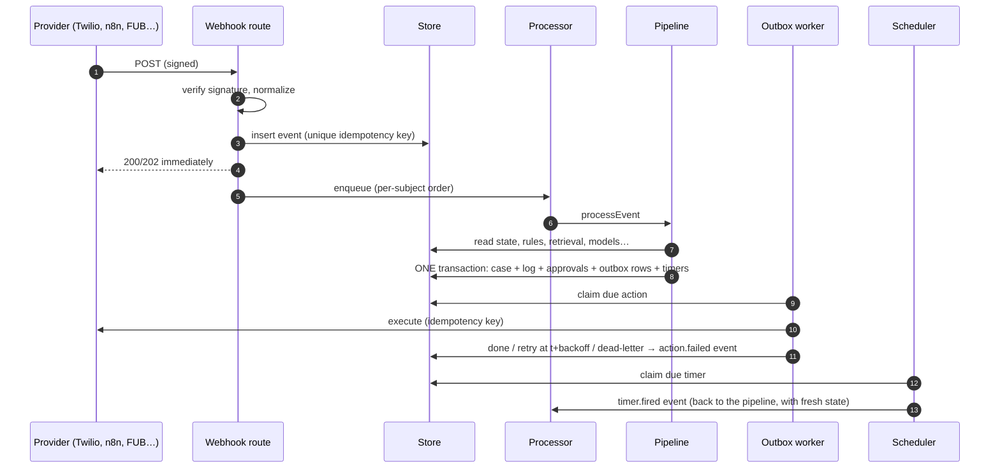

# Architecture

Mortar is one Node.js service with three moving parts — **intake**, the **pipeline**, and two **workers** — around one state store. Everything that happens is an event; everything Mortar does is a committed action.



## Components

| Component | File | Responsibility |
|---|---|---|
| Webhook routes | `src/http/webhooks.js` | Verify (Twilio HMAC-SHA1, FUB HMAC-SHA256, Mortar HMAC for n8n, ShowMojo bearer), normalize, ingest, acknowledge fast |
| Event normalizers | `src/core/events.js` | Vendor payload → one envelope `{type, source, idempotencyKey, occurredAt, subject, payload}`; auto-reply detection |
| Processor | `src/core/processor.js` | Persist-then-enqueue; strict order **per subject** (a phone, a mailbox, a case), parallel across subjects; crash recovery re-queues unprocessed events |
| Pipeline | `src/core/pipeline.js` | The nine stages; one transaction per event; optimistic concurrency with automatic re-run on conflict |
| Playbooks | `src/playbooks/*` | Domain logic as plain functions: `claim`, `open`, `decide`, `plan`, `summarize`, plus a state machine and model tasks |
| Model router | `src/models/router.js` | Tier order per task, schema validation + one repair, confidence floor, circuit breaker, frontier budget, cache, ledger |
| Retriever | `src/knowledge/retriever.js` | Scoped BM25 (optional embeddings + RRF), token budget |
| Policy | `src/core/policy.js` | 13 rules → allow · defer · approve · block, judged against the case *as it will be* after the plan |
| Outbox worker | `src/core/outbox.js` | Executes committed actions: claim, call connector with the idempotency key, retry with backoff + jitter, dead-letter |
| Scheduler | `src/core/scheduler.js` | Durable timers → `timer.fired` events; claimed atomically so each fires once |
| Escalation | `src/core/escalation.js` | On-call ladder: voice + SMS page, ACK, next level, bounded all-staff rounds |
| Connectors | `src/connectors/*` | Twilio, Postmark, Follow Up Boss, Rentvine (live) — and a simulated world with the same operations |
| Console + API | `src/http/api.js`, `public/` | Live state over SSE, approvals with edits, phones/inboxes, story player, failure injection |

## Why these boundaries

- **Persist before processing.** A webhook is acknowledged only after the event row exists. If the process dies, `recover()` re-queues it. A provider never waits on a model call, so it never retries because Mortar was slow.
- **Per-subject ordering.** Two texts from the same tenant are processed in order. Different tenants run in parallel. If two events race on the same case anyway (a timer and an SMS), the case `version` check rejects the loser, and it re-runs against fresh state.
- **Plans, not side effects.** Playbooks return *data*: actions, timers, facts, status. Nothing touches the outside world inside the pipeline. That is what makes validation, approval and idempotent replay possible.
- **One transaction.** Case state, timeline, approvals, outbox rows and timers commit together. A crash can't leave "work order created but nobody told".

## Data model

`src/core/schema.sql` — SQLite locally; the same tables port to Postgres/RDS (TEXT-JSON → JSONB).

| Table | Holds |
|---|---|
| `events` | Every inbound signal, its status and its full nine-stage trace (the audit log) |
| `parties`, `properties`, `units` | The directory: tenants, owners, staff, vendors, leads, prospects; buildings and the unit above |
| `cases` | One row per issue/lead: playbook, status, priority, **facts (JSON)**, a short rolling summary, external ids, flags, `version` |
| `case_log` | The human-readable timeline (inbound, decisions, model use, outbound, escalations) |
| `timers` | Durable follow-ups: `due_at`, `kind`, payload, status |
| `outbox` | Actions to execute: connector, operation, payload, idempotency key, attempts, next attempt, status |
| `approvals` | Held actions, the reason, the approver, the decision and any edits |
| `model_calls` | The ledger: task, tier, provider, model, outcome, tokens, cost, latency |
| `kv` | Small learned/configured state: on-call rota, lines, weather, lead-scorer weights, bandit arms |

## Deployment on BricksFolios' stack

| BricksFolios has | Mortar uses it as |
|---|---|
| Node.js platform | Mortar is a Node.js service (Express 5, ESM, no build step). It can run beside the platform or be folded into it as a module. |
| AWS RDS | The state store. The schema is plain SQL; move `store.js` from `node:sqlite` to `pg`. Worker claims become `UPDATE … WHERE status='pending' … FOR UPDATE SKIP LOCKED`, so several instances can run. |
| MongoDB | The platform's system of record for its own entities. Mortar reads what it needs via **directory sync** (`POST /directory/sync`, signed) or a read-only adapter. It never treats Mongo documents as prompt material. |
| AngularJS front end | The console is a reference UI. The same `/api` (state, cases, approvals, SSE stream) can back an AngularJS view inside the platform. |
| n8n | Integration glue only: relays, polling, cron (six workflows in `n8n/`). Decisions stay in code, where they are tested and versioned. |
| Twilio, FUB, Rentvine, ShowMojo | Connectors and verified webhooks; each one can be switched `simulated` → `live` on its own. |

Minimal production topology: Mortar (2+ instances behind a load balancer), RDS Postgres, Ollama (or vLLM) on a small GPU box (or CPU for 3–8B models at this volume), n8n, and Prometheus/Grafana or CloudWatch scraping `/metrics`.

## Adding a playbook

A playbook is a plain object (see `src/playbooks/maintenance/index.js`):

```js
export const renewals = {
  name: "renewals", casePrefix: "RN", machine, tasks,
  claim(event, ctx) { … },     // is this event mine? which case?
  open({ event, sender }) { … }, // first event → a new case
  decide(ctx) { … },             // stage 3: classify the situation; ask for a model only if needed
  plan(ctx, decision, { models, knowledge }) { … }, // stage 6: actions, timers, facts, status
  summarize(caseRecord) { … },   // the rolling summary — built by code
};
```

Register it in `src/app.js`. Retrieval, routing, policy, the outbox, timers, approvals, the console, traces and the ledger come for free.
