# AI Chatbot for WhatsApp + Instagram (n8n)

An importable **n8n** workflow that gives a small business (dental clinic, salon, …) an AI assistant on **WhatsApp** and **Instagram DMs**. It:

| Job description requirement | How this workflow does it |
|---|---|
| Answers FAQs from the client's own price list, services and hours | The knowledge base lives in a Google Sheet (`Knowledge` tab). It is injected into the Claude system prompt on every message, so the owner edits prices in the sheet and the bot is updated instantly. |
| WhatsApp Cloud API and/or Instagram (ManyChat or Meta API) | Native **WhatsApp Trigger** + **WhatsApp Business Cloud** nodes. Instagram via the **Meta Messaging webhook** (or **ManyChat** posting to the same webhook). One normalized message shape for all channels. |
| Lead capture into Google Sheets or a CRM | Every customer gets one row in the `Leads` tab (name, phone, email, service interest, status, booking). Swap the two Google Sheets nodes for HubSpot / Pipedrive / Airtable nodes if a CRM is preferred. |
| Appointment booking via Google Calendar | The model only *collects* service + date + time + name. The workflow validates the slot, checks **free/busy** in Google Calendar, creates the event and writes the confirmation itself. |
| Human hand-off when the bot is unsure, plus owner notifications | Deterministic guardrails (confidence threshold, price guard, "not in knowledge base", customer asks for a person, API errors) → safe hand-off reply, lead marked `status = human`, **Gmail** alert to the owner. While a human handles the chat the bot stays silent. |
| Basic testing before launch | Sample messages are **pinned** on both triggers (click *Test workflow*), 33 unit tests cover the logic nodes (`dev/`), and `tests/test-cases.md` is the pre-launch checklist. |

Built with: n8n (self-hosted or cloud), Claude (Anthropic Messages API with structured JSON output), Google Sheets, Google Calendar, Gmail, Meta Graph API.

---

## 1. How it works

```mermaid
flowchart LR
  WA[WhatsApp Trigger] --> N[Normalize Message]
  IG[Instagram webhook] --> N
  N --> C[Client Config] --> KB[Load Knowledge Base] --> LL[Lookup Lead] --> LH[Load Conversation History] --> AC[Assemble Context] --> T{Triage}
  T -- ignore --> X[Duplicate delivery: stop]
  T -- human --> HM[Log message + email owner, send nothing]
  T -- bot --> BR[Build Claude Request] --> CL[Ask Claude] --> P[Parse + Guardrails] --> R{Route Decision}
  R -- answer --> AR[Answer Reply]
  R -- book --> V[Validate Slot] --> FB[Calendar free/busy] --> CE[Create Event] --> BC[Booking Confirmed Reply]
  R -- handoff --> HR[Handoff Reply]
  AR --> F[Finalize Reply]
  BC --> F
  HR --> F
  F --> S{Route by Channel}
  S --> SW[Send WhatsApp] --> UL
  S --> SI[Send Instagram] --> UL[Upsert Lead] --> LOG[Append Conversation Log] --> O{Owner alert?} --> E[Gmail to owner]
```



The canvas is split into six colour-coded sections, each with a sticky note that explains it. Node by node:

### Section 1 · Inbound channels
| Node | What it does |
|---|---|
| **WhatsApp Trigger** | Receives WhatsApp Cloud API messages. Verifies Meta's signature, registers the webhook for you, ignores delivery/read receipts. |
| **Instagram Verify (GET)** → **Verify Token OK?** → **Respond: hub.challenge / 403** | Meta's one-time webhook verification handshake. Edit the verify token inside *Verify Token OK?*. |
| **Instagram Inbound (POST)** | Receives Instagram DMs and answers `200` immediately (Meta requires a fast response). |
| **Normalize Message** (Code) | Converts WhatsApp, Instagram and ManyChat payloads into one shape: `channel, contact_id, contact_key, contact_name, text, message_id, message_type`. Echoes of our own replies, status receipts and empty payloads produce no item, so the run ends quietly. Images/voice notes become a readable placeholder so the bot can ask the customer to type. |

### Section 2 · Context (one node to configure a client)
| Node | What it does |
|---|---|
| **Client Config** (Set) | Every client-specific value in one place: business name, timezone, booking hours, closed days, slot length, owner e-mail, Google Sheet ID, Calendar ID, WhatsApp phone-number ID, Instagram page ID, Claude model, hand-off threshold, hand-off message. **Duplicate the workflow per client and edit only this node.** |
| **Load Knowledge Base** | Reads the `Knowledge` tab (category, title, content). |
| **Lookup Lead** | Reads this customer's row in `Leads` (is a human handling them? what do we already know?). |
| **Load Conversation History** | Reads this customer's previous turns from `Conversations` (the bot's memory). |
| **Assemble Context** (Code) | Formats the knowledge base by category, rebuilds the last N turns as Claude messages, and decides the **Triage**: `bot` (answer), `human` (a person owns this chat → stay silent), `ignore` (Meta re-delivered a message we already logged). |
| **Human Mode Log Row → Log Message (Human Mode) → Notify Owner (Human Mode)** | When a human owns the chat: log the customer's message and e-mail the owner. No automatic reply. |

### Section 3 · AI brain + guardrails
| Node | What it does |
|---|---|
| **Build Claude Request** (Code) | Writes the system prompt (strict rules + knowledge base, cached) and a live block (today's date, hours, customer profile). Asks for **strict JSON** via `output_config.format` (json_schema): `intent, reply, confidence, needs_human, handoff_reason, lead{…}, booking{…}`. See `prompts/system-prompt.md`. |
| **Ask Claude** (HTTP Request) | One call to `POST https://api.anthropic.com/v1/messages` with the *Anthropic* credential. On API errors it continues so the customer still gets the safe hand-off reply. |
| **Parse Claude Response** (Code) | Reads the JSON, then applies checks the model cannot bypass (see §5). Produces `decision = answer | book | handoff` and merges lead details (this turn > existing row > channel profile name). |
| **Route Decision** (Switch) | Sends the item to the matching branch. |

### Section 4 · Actions
| Branch | Nodes | Behaviour |
|---|---|---|
| answer | **Answer Reply** | Send the model's reply as-is. |
| book | **Validate Booking Slot** → **Slot Valid?** → **Check Calendar Availability** → **Slot Free?** → **Create Calendar Event** → **Booking Confirmed Reply** | The slot must be in the future, on an open day and inside booking hours; then Google Calendar free/busy must be empty for the slot. Only then is the event created and the confirmation written **by the workflow** (never by the model). Invalid or busy slots get a deterministic "please choose another time" reply (**Invalid Slot Reply** / **Slot Taken Reply**). |
| handoff | **Handoff Reply** | Fixed, safe message from Client Config; lead becomes `status = human`; owner is e-mailed in section 6. |

### Section 5 · Send
| Node | What it does |
|---|---|
| **Finalize Reply** (Code) | Single merge point for all branches. Strips markdown, applies channel formatting (Instagram has no bold), caps length, falls back to the hand-off message if the text is empty. |
| **Route by Channel** → **Send WhatsApp Reply** / **Send Instagram Reply** | WhatsApp Business Cloud node, or Instagram Send API (`POST /{page-id}/messages`). |

### Section 6 · Lead capture, memory, owner alerts
| Node | What it does |
|---|---|
| **Lead Row** → **Upsert Lead** | One row per customer in `Leads`, matched on `contact_key`. Keeps `first_seen_at`, `handoff_at` and old booking data when nothing new arrived. |
| **Conversation Log Row** → **Append Conversation Log** | One row per turn: customer message, bot reply, intent, confidence, guardrail notes, message id (for de-duplication), tokens used (for cost tracking). |
| **Owner Alert Needed?** → **Notify Owner** | Gmail to the owner on every hand-off and every confirmed booking, with the conversation and what to do next. |

---

## 2. What is in this folder

```
whatsapp-instagram-ai-chatbot/
├── README.md                          ← this file
├── n8n/ai-chatbot-whatsapp-instagram.json   ← import this into n8n
├── prompts/system-prompt.md           ← the prompt + JSON schema, explained
├── google-sheets/
│   ├── Knowledge.csv                  ← sample knowledge base (dental clinic)
│   ├── Leads.csv                      ← column headers for the Leads tab
│   └── Conversations.csv              ← column headers for the Conversations tab
├── tests/
│   ├── test-cases.md                  ← pre-launch test checklist
│   ├── sample-whatsapp-webhook.json   ← pin on "WhatsApp Trigger"
│   ├── sample-instagram-webhook.json  ← pin on "Instagram Inbound (POST)"
│   └── sample-manychat-request.json   ← body for a ManyChat External Request
├── docs/
│   ├── make-com-equivalent.md         ← same design as a Make.com scenario
│   └── application-note.md            ← answers for the job application
└── dev/                               ← optional: regenerate the JSON / run unit tests
```

---

## 3. Setup (about 60–90 minutes the first time)

### Step 1 · Google Sheet
1. Create a Google Sheet and add three tabs named exactly **Knowledge**, **Leads**, **Conversations**.
2. Import `google-sheets/Knowledge.csv` into *Knowledge* (File → Import → Replace current sheet) and edit it for the client. Columns: `category` (services / hours / location / booking / policies / faq), `title`, `content`.
3. Paste the header row from `Leads.csv` into *Leads* and from `Conversations.csv` into *Conversations* (row 1 only).
4. Copy the spreadsheet ID from the URL (`…/spreadsheets/d/<ID>/edit`).

### Step 2 · Google credentials in n8n
Create one Google OAuth2 app (n8n docs → Google OAuth) and add three credentials in n8n: **Google Sheets OAuth2**, **Google Calendar OAuth2**, **Gmail OAuth2**. The calendar ID is the Gmail address of the primary calendar, or `xxxx@group.calendar.google.com` for a dedicated "Appointments" calendar (recommended).

### Step 3 · Anthropic
Create an API key at console.anthropic.com and add an **Anthropic** credential in n8n. The workflow sends `anthropic-version: 2023-06-01` itself.

### Step 4 · WhatsApp Cloud API (Meta)
1. In [developers.facebook.com](https://developers.facebook.com) create an app → add the **WhatsApp** product. Note the **App ID**, **App Secret**, **Phone number ID** and create a permanent **System User access token** with `whatsapp_business_messaging` + `whatsapp_business_management`.
2. n8n credential **WhatsApp OAuth** (for the trigger): Client ID = App ID, Client Secret = App Secret.
3. n8n credential **WhatsApp API** (for sending): Access Token + WhatsApp Business Account ID.
4. The trigger node registers the webhook with Meta automatically when the workflow is activated.

### Step 5 · Instagram (choose one)
**Option A – Meta API (no third party).** Instagram *professional* account linked to a Facebook Page; in the same Meta app add **Instagram → Messaging**, subscribe the page to the `messages` webhook field, set the callback URL to the n8n production URL of *Instagram Inbound (POST)* and the verify token you typed into *Verify Token OK?*. Create a Page access token with `instagram_manage_messages`, `pages_manage_metadata`, `instagram_basic` and store it in n8n as a **Header Auth** credential (Name `Authorization`, Value `Bearer <token>`), used by *Send Instagram Reply*. Set `instagram_page_id` in Client Config.

**Option B – ManyChat.** Connect Instagram to ManyChat, add a default reply flow with an **External Request** action: POST to the *Instagram Inbound (POST)* URL with the body in `tests/sample-manychat-request.json`. Replies can either keep going through the Meta API (Option A's token) or you can replace *Send Instagram Reply* with a ManyChat "send content" API call.

### Step 6 · Import and connect
1. n8n → Workflows → **Import from file** → `n8n/ai-chatbot-whatsapp-instagram.json`.
2. Open each node that shows a credential warning and pick the credential:

| Node(s) | Credential |
|---|---|
| WhatsApp Trigger | WhatsApp OAuth (App ID + Secret) |
| Send WhatsApp Reply | WhatsApp API (access token + business account ID) |
| Load Knowledge Base · Lookup Lead · Load Conversation History · Upsert Lead · Append Conversation Log · Log Message (Human Mode) | Google Sheets OAuth2 |
| Check Calendar Availability · Create Calendar Event | Google Calendar OAuth2 |
| Notify Owner · Notify Owner (Human Mode) | Gmail OAuth2 |
| Ask Claude | Anthropic |
| Send Instagram Reply | Header Auth (`Authorization: Bearer <page token>`) |

3. Open **Client Config** and fill in every value (sheet ID, calendar ID, phone-number ID, page ID, owner e-mail, hours, timezone, business name).
4. Open **Verify Token OK?** and replace `CHANGE_ME_instagram_verify_token` with your own secret (same value you give Meta).
5. Workflow settings → set the **timezone** to the client's timezone (used for calendar events).

### Step 7 · Test, then go live
1. Click **Test workflow**. Both triggers carry pinned sample messages, so the whole flow runs without a phone: you should see rows appear in *Leads* and *Conversations* and a reply attempt on the send node (it will fail only if the sample phone number is not a real WhatsApp test recipient — that is expected).
2. Unpin the triggers (open the node → *Unpin*), activate the workflow, and run the checklist in `tests/test-cases.md` from a real phone / Instagram account.
3. Hand the owner the sheet link and the one-page "how to take over a chat" note (section 6 below).

---

## 4. Booking logic (why the model never books by itself)

1. The model collects **service, date, time, name** across turns, repeats them back and asks for confirmation. Only after the customer confirms does it set `booking.ready_to_book = true` with an absolute `YYYY-MM-DD` date and `HH:MM` time (it receives today's date and the booking hours in the prompt).
2. **Validate Booking Slot** rejects past times, closed days and anything outside `opening_time`–`closing_time` (the slot must also *end* before closing).
3. **Check Calendar Availability** asks Google Calendar for free/busy on exactly that slot.
4. **Create Calendar Event** writes the event (summary = service + customer name, description = channel, phone, last message).
5. The confirmation text is produced by the workflow from the validated data, and the booking is stored on the lead row (`booking_datetime`, `calendar_event_link`) and e-mailed to the owner.

Busy or invalid slots return a deterministic reply listing the opening hours, and the conversation simply continues.

---

## 5. How wrong answers are prevented

Five layers, from "prevent" to "catch":

1. **Single source of truth.** The prompt says: answer *only* from the APPROVED KNOWLEDGE BASE; quote prices and hours exactly; if it is not there, say you will check with the team and set `needs_human`. The knowledge base is a Google Sheet the owner controls.
2. **Structured output, not free text.** Claude must return JSON that matches a schema (`output_config.format`). The workflow, not the model, decides what is sent, booked or escalated.
3. **Self-reported confidence with a hard threshold.** `confidence < handoff_confidence_threshold` (default 0.6) → hand-off, whatever the reply says.
4. **Price guard (deterministic).** Every currency amount in the reply (`PKR 3,500`, `Rs. 4000`, `$25`, …) must exist as a number in the knowledge base. An invented or miscalculated price can never reach the customer.
5. **Hard triggers.** Customer asks for a person / complains → hand-off. API error, refusal, truncated or unreadable output → hand-off. Empty reply → hand-off. The hand-off message itself is a fixed string from Client Config.

Plus **memory discipline** (only the last `max_history_turns` turns are sent, so old context cannot leak), **no bookings by the model** (§4), and a **conversation log** with the guardrail reason on every row, so bad answers are visible and the knowledge base can be improved.

---

## 6. Human hand-off — what the owner does

- On every hand-off the owner gets an e-mail with the customer, the channel, the last message, the bot's reply and the reason.
- The lead row is set to `status = human`. From then on the bot **stays silent** for that customer (new messages are still logged and the owner is e-mailed again).
- The owner replies from the WhatsApp Business app or the Instagram inbox.
- To give the chat back to the bot: set `status = bot` on the lead row. The bot also resumes automatically after `human_mode_timeout_hours` (default 12).

---

## 7. Reusing it for the next client

Duplicate the workflow, edit **Client Config**, point it at a new Google Sheet + calendar + WhatsApp number / Instagram page, and import the client's price list into the *Knowledge* tab. No other node changes. (One workflow per client keeps credentials, logs and billing separate, which also matches the agency's "limited access per project" terms.)

---

## 8. Make.com equivalent

The same design as a Make scenario (module-by-module mapping) is in `docs/make-com-equivalent.md`.

---

## 9. Known limits and sensible next steps

| Limit | Next step |
|---|---|
| Voice notes / images are not understood (the bot asks the customer to type). | Add an OpenAI/Deepgram transcription node before *Normalize Message* for `audio` messages. |
| Owner alerts are by e-mail. | Add a WhatsApp **template** message (required outside the 24-hour window) or a Telegram node after *Owner Alert Needed?*. |
| One conversation per execution (Meta sends one sender per webhook call). Several rapid messages from the same customer are merged into one turn. | Fine for clinics/salons; for very high volume add a short debounce queue (Redis) in front. |
| Instagram usernames are not fetched. | Add one Graph API call `GET /{igsid}?fields=name,username` after *Normalize Message*. |
| Reminders before the appointment. | A second, scheduled workflow reading `Leads.booking_datetime` and sending a template message the day before. |
| Voice agents (Vapi / Retell) are out of scope here. | The same *Build Claude Request* → *Parse* → *Validate Slot* chain can be exposed as a webhook tool for a Vapi/Retell assistant. |

---

## 10. For developers: regenerating the workflow and running the tests

The six Code nodes are kept as plain files in `dev/code/` so they can be reviewed, diffed and unit-tested outside n8n.

```bash
cd whatsapp-instagram-ai-chatbot/dev
npm install          # luxon only (the same date library n8n exposes to Code nodes)
npm test             # 33 tests: payload normalization, triage, prompt/schema shape, guardrails, slot validation, formatting
npm run build        # rewrites ../n8n/ai-chatbot-whatsapp-instagram.json from dev/code + build-workflow.js
```

The build script also validates the graph (every connection targets an existing node, every non-trigger node has an input, every Switch output is wired) before writing the file.
